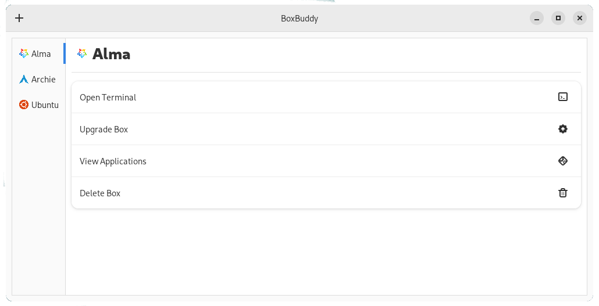

# BoxBuddy
Unofficial GUI for managing your Distroboxes. Written with GTK4 + Libadwaita.

## Deprecated
This version is now deprecated in favour of [the Rust version](https://github.com/Dvlv/BoxBuddyRS). It has all the same functionality.

An old Qt version available [here](https://github.com/Dvlv/BoxBuddy), though this is no longer supported.

