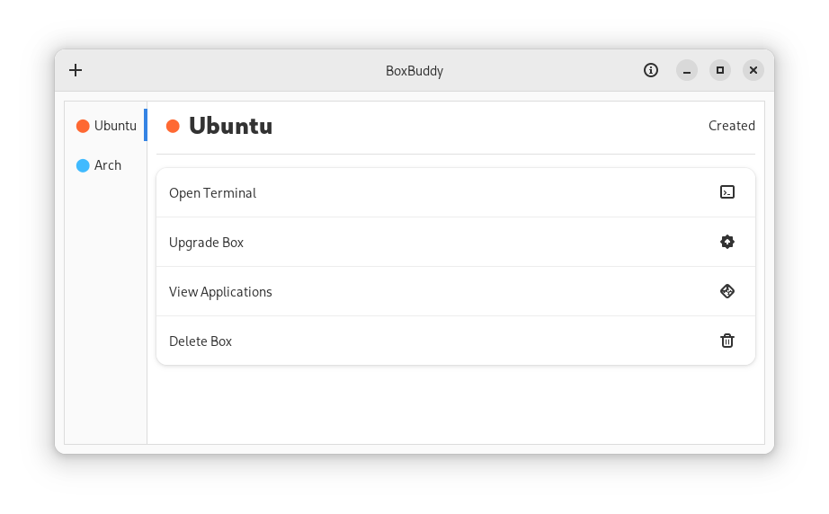

# BoxBuddy
Unofficial GUI for managing your Distroboxes. Written with GTK4 + Libadwaita.

Old Qt version available [here](https://github.com/Dvlv/BoxBuddy)

Note that this does not come with Podman or Distrobox, those will need to be installed on the host.

## Installing
Flathub soon maybe.

For now:

- Clone or download this repo
- `flatpak install boxbuddy.flatpak`

## Developing

Written with Python3.10+ Gtk4 and Libadwaita.

### Building Flatpak
- Install `flatpak-builder`
- `./flatpak-build.sh`
- `./singlefile.sh`
- `flatpak install --user boxbuddy.flatpak`

### Running Locally
- Install gtk4 development packages - check your distro for something like `gtk4-devel` or `gtk-dev`, etc.
- Install python3.10 or higher
- Run `python3 src/app.py`

